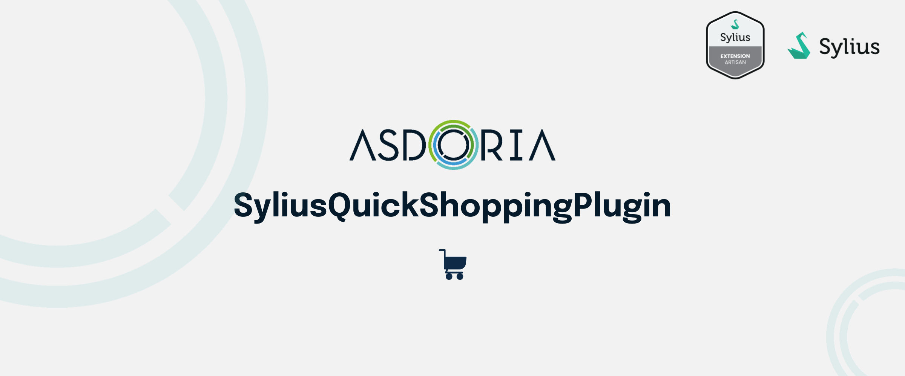

# Asdoria Quick Shopping Plugin

[](https://github.com/asdoria/AsdoriaSyliusQuickShoppingPlugin/actions/workflows/build.yml)
[](https://packagist.org/packages/asdoria/sylius-quick-shopping-plugin) 
[](https://packagist.org/packages/asdoria/sylius-quick-shopping-plugin) 
[](https://packagist.org/packages/asdoria/sylius-quick-shopping-plugin)
[](https://packagist.org/packages/asdoria/sylius-quick-shopping-plugin) 

Simple QuickShopping management for Sylius Shops. Add multiple products to your cart using a single page!


## Features

+ Add multiple variants to your shopping cart by name or code

<div style="max-width: 75%; height: auto; margin: auto">
 


</div>

<div style="max-width: 75%; height: auto; margin: auto">

</div>

 

## Installation

---
1. Run `composer require asdoria/sylius-quick-shopping-plugin`


2. Add the bundle in `config/bundles.php`.

```PHP
Asdoria\SyliusQuickShoppingPlugin\AsdoriaSyliusQuickShoppingPlugin::class => ['all' => true],
```

3. Import routes in `config/routes.yaml`

```yaml
asdoria_quick_shopping:
    resource: "@AsdoriaSyliusQuickShoppingPlugin/config/routing.yaml"
```

4. Import config in `config/packages/_sylius.yaml`
```yaml
imports:
    - { resource: "@AsdoriaSyliusQuickShoppingPlugin/config/config.yaml"}
```

5. Paste the following content to the `src/Repository/ProductVariantRepository.php`:
```php
  <?php

  declare(strict_types=1);

  namespace App\Repository;

  use Asdoria\SyliusQuickShoppingPlugin\Repository\Model\ProductVariantRepositoryAwareInterface;
  use Asdoria\SyliusQuickShoppingPlugin\Repository\ProductVariantRepositoryTrait;
  use Sylius\Bundle\CoreBundle\Doctrine\ORM\ProductVariantRepository as BaseProductVariantRepository;
  
  final class ProductVariantRepository extends BaseProductVariantRepository implements ProductVariantRepositoryAwareInterface
  {
      use ProductVariantRepositoryTrait;
  }
```
   
6. Configure repositories in `config/packages/_sylius.yaml`:
```diff  
 sylius_product:
     resources:
         product_variant:
             classes:
                 model: App\Entity\Product\ProductVariant
+                repository: App\Repository\ProductVariantRepository
```
   
## Demo

You can try the QuickShopping plugin online by following this link: [here](https://demo-sylius.asdoria.fr/en_US/quick-shopping).

Note that we have developed several other open source plugins for Sylius, whose demos and documentation are listed on the [following page](https://asdoria.github.io/).

## Usage

In the shop office, go to /en_US/quick-shopping (`asdoria_shop_quick_shopping_index` route).

## Contribution

Wish to contribute? Please do! We are always looking for improving this plugin. To do so, feel free to raise PR or issues on this repo.

This plugin is part of Asdoria work on Open Source, feel free to look on our current as well as future work on [our website](https://asdoria.github.io/).

Have a nice day :)

